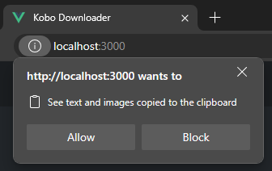

# Kobo Downloader (Vue)

Utility for downloading purchased audiobook MP3 and decrypted epub files from your [Kobo](https://www.kobo.com) account.

# How To Use
> :warning: The executable involves hosting a small web server on your computer. When first launched, Windows may ask to confirm granting the app access to your network.

Instructions for just using the executable to run the application and download audiobooks and ebooks from Kobo:

1. Download latest relase from [here](https://github.com/PrimalZed/kobo-book-downloader-vue).
2. Run `kbd.exe` (May ask to grant network access to run a small web server hosting the app)

kbd.exe running in terminal

3. Open web browser to [http://localhost:3000](http://localhost:3000)
4. Sign in with kobo.com username and password, and following instructions to get captcha

Sign In Page

5. Download audiobook (audio files in .zip) or books (.epub)

Audiobooks Page

Books Page

# Development
Requires `npm`

## Run
1. `npm ci`
2. `npm run dev`
3. Open in [http://localhost:5173](http://localhost:5173)

## Build Nodejs
1. `npm ci`
2. `npm run build`

Creates `dist` folder with files to run with node. Can be run with `node dist/index.cjs`, and the web app access at [http://localhost:3000](http://localhost:3000)

## Publish Executable
1. `npm ci`
2. `npm run build`
3. `npm run publish`

Creates `artifacts/kbd.exe` file. Can be run with `kbd.exe`, and the web app accessed at [http://localhost:3000](http://localhost:3000).

# Acknowledgments
This app is latest in a line of work from others:
* subdavis' [kobodl](https://github.com/subdavis/kobo-book-downloader)
* TnS-hun's [kobo-book-downloader](https://github.com/TnS-hun/kobo-book-downloader)
* Physisticated's [obok.py](https://github.com/apprenticeharper/DeDRM_tools/blob/master/Other_Tools/Kobo/obok.py)

# TODO:
* Replace pkg with node single executable app: https://nodejs.org/api/single-executable-applications.html
