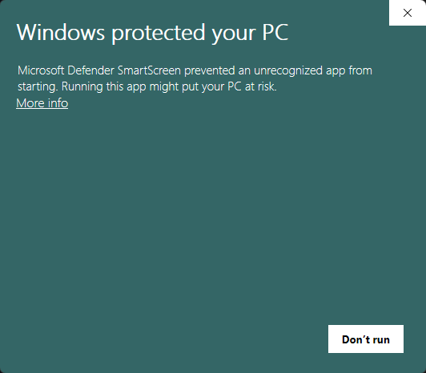
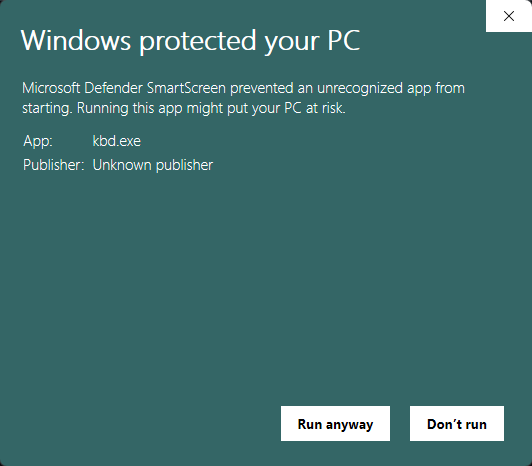
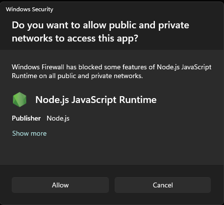
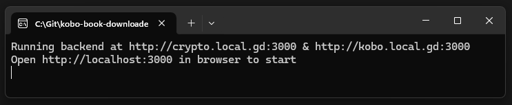
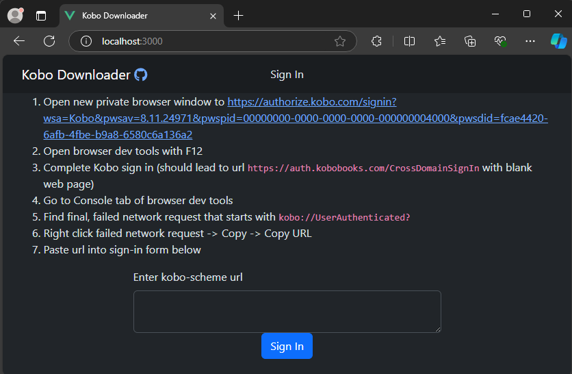
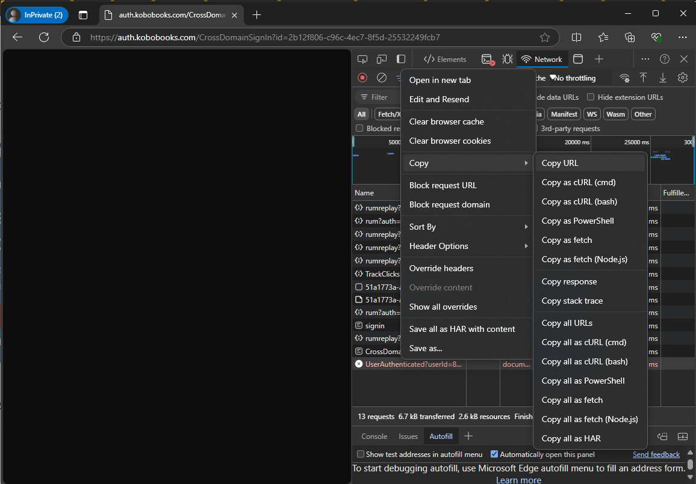
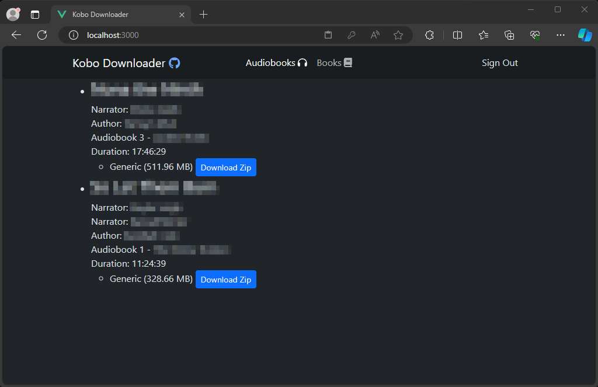
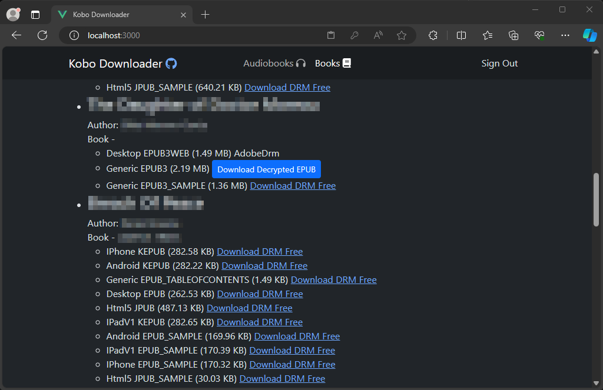

# Kobo Downloader (Vue)

Utility for downloading purchased audiobook MP3 and decrypted epub files from your [Kobo](https://www.kobo.com) account.

# How To Use
> [!WARNING]
> :construction: As an independently-made .exe without a paid signing certificate, Microsoft Defender SmartScreen may not recognize `kbd.exe` and share a warning when trying to run it. This can be surpassed by clicking `More Info`, followed by `Run Anyway`. Alternatively, you can download the source code and run it yourself with [Development instructions below](#development) (requires node/npm).
> 

> 
Microsoft Defender SmartScreen warning

> 
> 
> 

> 

> 
Microsoft Defender SmartScreen after clicking 'More Info'

> 
> 
> 

 

> [!WARNING]
> :signal_strength: The executable will host a small web server on your computer. It is used to proxy requests to Kobo's web api and to decrypt files with Kobo's DRM.
> 
> :key: When first launched, Windows Security may ask to confirm granting the app access to your network. This must be allowed for the application to work.
> 

> 
Network Access warning

> 
> 
> 

Instructions for just using the executable to run the application and download audiobooks and ebooks from Kobo:

## Windows
1. [Download `kbd.exe` from latest release here.](https://github.com/PrimalZed/kobo-book-downloader-vue/releases)
1. Run `kbd.exe` (See above for expected warnings)

## macOS (Apple Silicon)
1. [Download `kbd` from latest release here.](https://github.com/PrimalZed/kobo-book-downloader-vue/releases)
1. Make it executable: `chmod +x kbd`
1. Run `./kbd`
1. If macOS blocks it, go to System Preferences > Security & Privacy and allow it to run

kbd.exe running in terminal

3. Open web browser to [http://localhost:3000](http://localhost:3000)
1. Follow instructions to get Kobo device authentication

Sign In Page

5. Download audiobook (audio files in .zip) or books (.epub)

Audiobooks Page

Books Page

# Development
Requires [`npm`](https://www.npmjs.com/)

## Run
1. `git clone https://github.com/PrimalZed/kobo-book-downloader-vue.git` to get source files
1. `npm ci` to install dependency packages in this workspace
1. `npm run dev`
1. Open in [http://localhost:5173](http://localhost:5173)

## Build Nodejs
1. `git clone https://github.com/PrimalZed/kobo-book-downloader-vue.git` to get source files
1. `npm ci` to install dependency packages in this workspace
1. `npm run build`

Creates `dist` folder with files to run with node. Can be run with `node dist/index.cjs`, and the web app access at [http://localhost:3000](http://localhost:3000)

## Create executables
1. `git clone https://github.com/PrimalZed/kobo-book-downloader-vue.git` to get source files
1. `npm ci` to install dependency packages in this workspace
1. `npm run build`
1. `npm run publish`

Creates executable files in the `artifacts/` folder:
- `kbd.exe` (Windows)
- `kbd` (macOS Apple Silicon)

These can be moved/shared to run from anywhere, and the web app accessed while running at [http://localhost:3000](http://localhost:3000).

For detailed macOS build information, see [README-M1.md](README-M1.md).

## Tech Stack
This application is built with [`Node.js`](https://nodejs.org/en), [`express`](https://expressjs.com/), and [`Vue.js`](https://vuejs.org/).

# Acknowledgments
This app is latest in a line of work from others:
* subdavis' [kobodl](https://github.com/subdavis/kobo-book-downloader)
* TnS-hun's [kobo-book-downloader](https://github.com/TnS-hun/kobo-book-downloader)
* Physisticated's [obok.py](https://github.com/apprenticeharper/DeDRM_tools/blob/master/Other_Tools/Kobo/obok.py)

# TODO
* Replace pkg with node single executable app: https://nodejs.org/api/single-executable-applications.html
  * Having trouble with all dependencies in single file during snapshot: depd throws 'callSite.getFileName is not a function'
    * Try webpack instead of rollup? Other rollup plugins to better encapsulate dependencies?
    * Maybe solve single-file issues with depd by dropping express? https://developer.mozilla.org/en-US/docs/Learn/Server-side/Node_server_without_framework
* Electron instead of node.js web backend?
  * Not sure whether authentication would work
